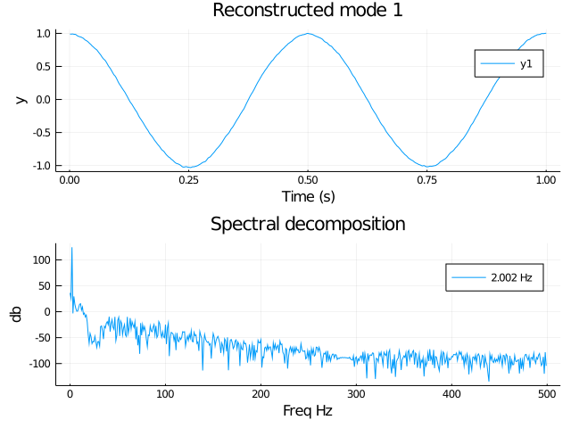
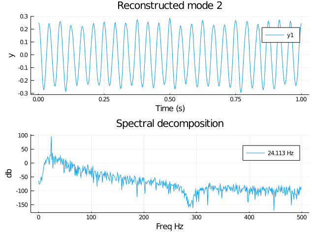
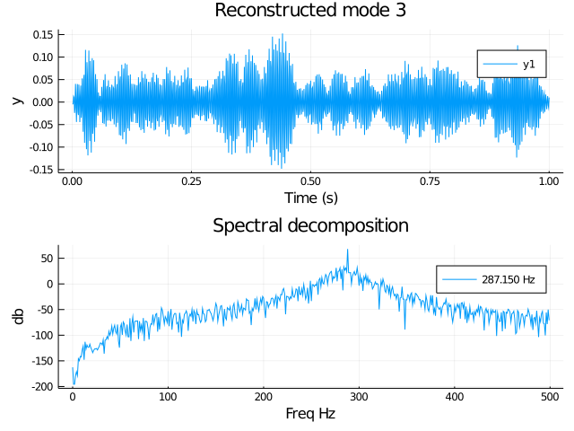
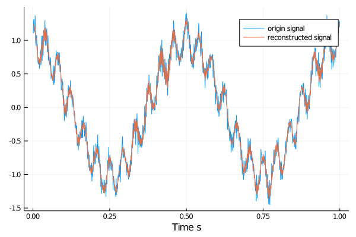

# VMD.jl

A package for `Variational Mode Decompostion` in julia

Ref: `Variational Mode Decompostion` ,

doi:10.1109/tsp.2013.2288675

IEEE Transactions on Signal Processing

## Introduction
The goal of VMD is to decompose a real valued input signal $f$
into a discrete number of sub-signals (modes),$u_k$
, that have
specific sparsity properties while reproducing the input Here,
the sparsity prior of each mode is chosen to be its bandwidth
in spectral domain. In other words, we assume each mode $k$
to
be mostly compact around a center pulsation $\omega_k$
, which is to be
determined along with the decomposition.

## Example

```julia
T = 1000;
t = (1:T)/T;
sample_frequency = 1000;

# center frequencies of components
f_1 = 2;
f_2 = 24;
f_3 = 288;

# modes
v_1 = @. cos(2*pi*f_1*t);
v_2 = @. 1/4*(cos(2*pi*f_2*t));
v_3 = @. 1/16*(cos(2*pi*f_3*t));

# composite signal, including noise
f = v_1 + v_2 + v_3 + 0.1*randn(length(v_1));

# some sample parameters for VMD
alpha = 2000;       # moderate bandwidth constraint
tau = 0;            # noise-tolerance (no strict fidelity enforcement)
K = 3;              # 3 modes
DC = false;             # no DC part imposed
init = 1;           # initialize omegas uniformly
tol = 1e-7;


v = vmd(f ; alpha = alpha,tau = tau,K = K,DC = false,init = 1,tol = tol,sample_frequency = sample_frequency)
```
### plot original signal and spectrum
```plot(v;k = 0)```


### plot 1st decomposed component and spectrum
```plot(v;k = 1)```


### plot 2st decomposed component and spectrum
```plot(v;k = 2)```


### plot 3st decomposed component and spectrum
```plot(v;k = 3)```


### compare original signal and sum of reconstructed signal
```compare(v)```
